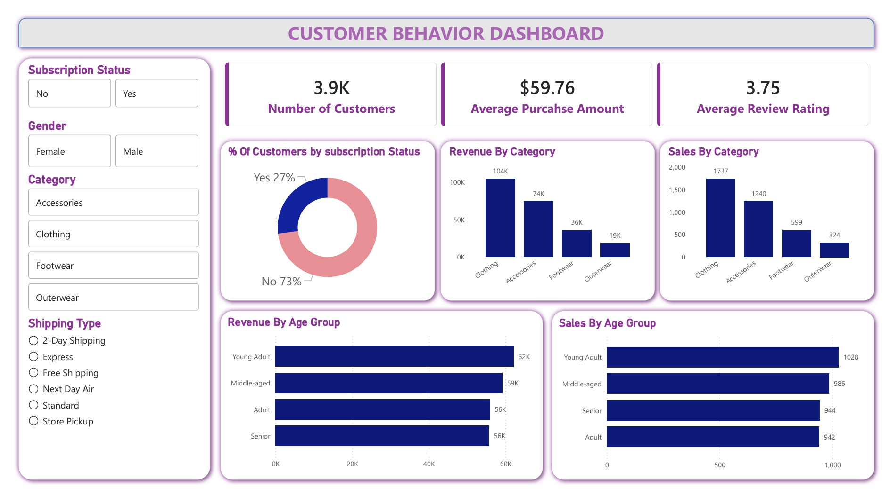

# Customer Behavior Dashboard

## 📌 Project Overview
This project analyzes customer behavior data to understand purchasing patterns,
customer segments, and key business insights using SQL, Python, and Power BI.

## 🎯 Objectives
- Analyze customer purchase behavior
- Identify high-value customers
- Understand sales trends and patterns
- Build an interactive dashboard for insights

## 🛠️ Tools & Technologies
- Python (Pandas, NumPy, Matplotlib)
- SQL (MySQL / PostgreSQL)
- Power BI
- Excel

## 📊 Dashboard Preview

## 🔍 Key Insights
- Repeat vs one-time customer behavior
- Top contributing customer segments
- Purchase frequency analysis
- Revenue trends by customer category

